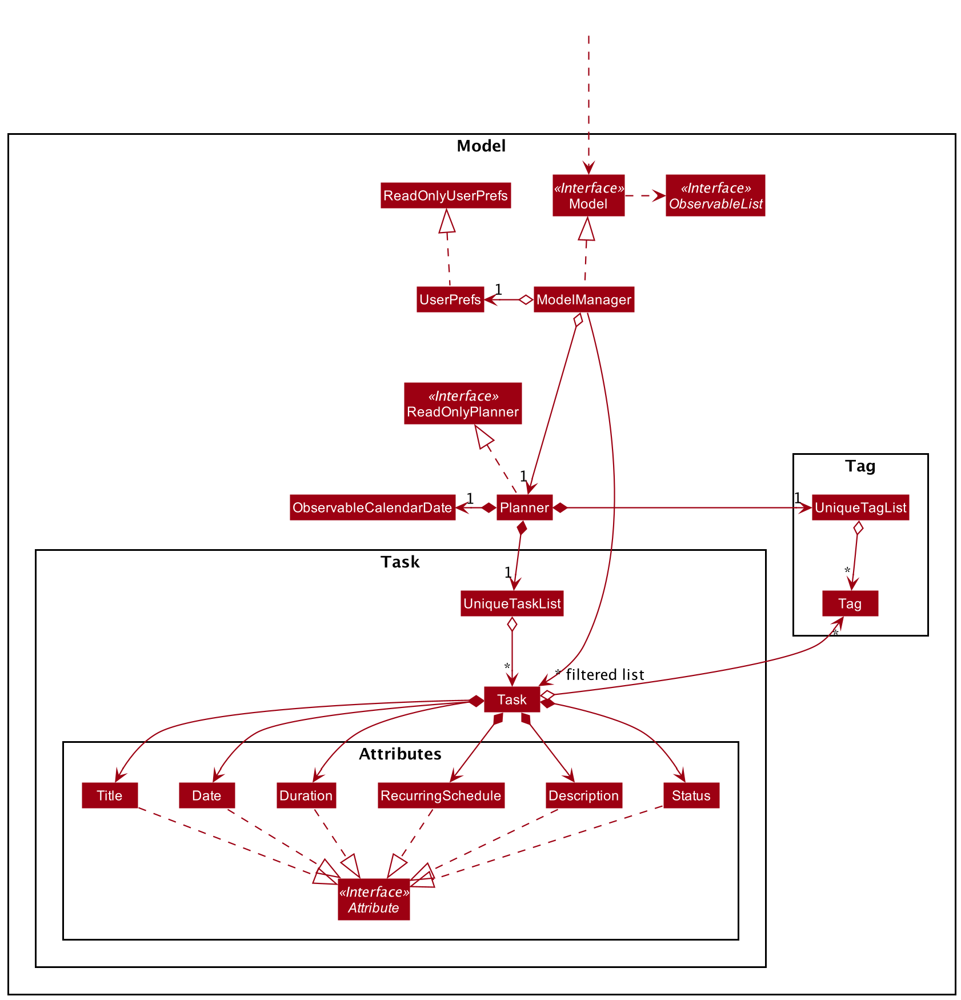
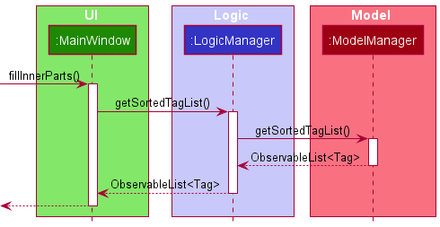
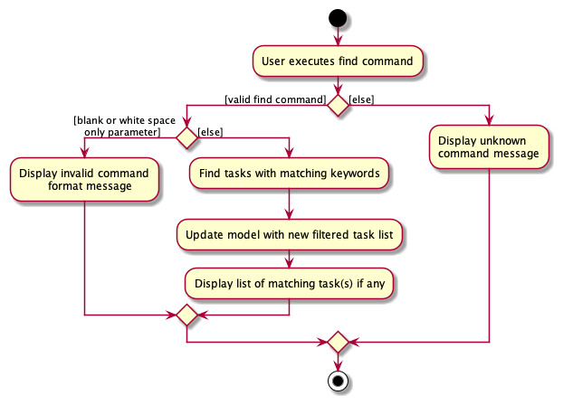
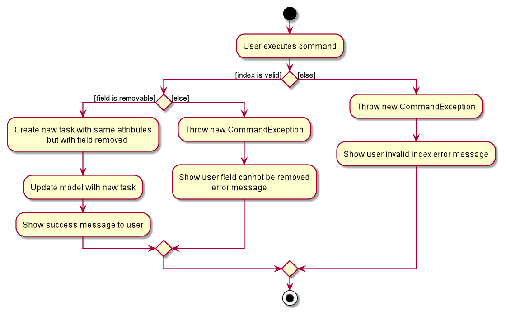
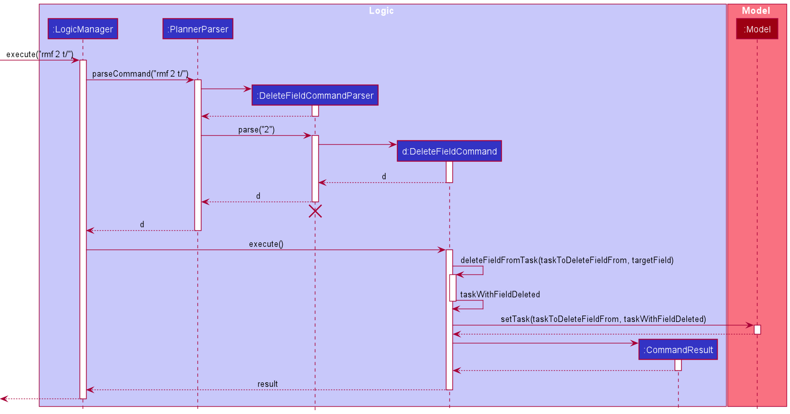

* Table of Contents
{:toc}

--------------------------------------------------------------------------------------------------------------------

## **Setting up, getting started**

Refer to the guide [_Setting up and getting started_](SettingUp.md).

--------------------------------------------------------------------------------------------------------------------

## **Design**

### Architecture

The ***Architecture Diagram*** given above explains the high-level design of the App. Given below is a quick overview of each component.

:bulb: **Tip:** The `.puml` files used to create diagrams in this document can be found in the [diagrams](https://github.com/se-edu/addressbook-level3/tree/master/docs/diagrams/) folder. Refer to the [_PlantUML Tutorial_ at se-edu/guides](https://se-education.org/guides/tutorials/plantUml.html) to learn how to create and edit diagrams.

**`Main`** has two classes called [`Main`](https://github.com/se-edu/addressbook-level3/tree/master/src/main/java/seedu/address/Main.java) and [`MainApp`](https://github.com/se-edu/addressbook-level3/tree/master/src/main/java/seedu/address/MainApp.java). It is responsible for,
* At app launch: Initializes the components in the correct sequence, and connects them up with each other.
* At shut down: Shuts down the components and invokes cleanup methods where necessary.

[**`Commons`**](#common-classes) represents a collection of classes used by multiple other components.

The rest of the App consists of four components.

* [**`UI`**](#ui-component): The UI of the App.
* [**`Logic`**](#logic-component): The command executor.
* [**`Model`**](#model-component): Holds the data of the App in memory.
* [**`Storage`**](#storage-component): Reads data from, and writes data to, the hard disk.

Each of the four components,

* defines its *API* in an `interface` with the same name as the Component.
* exposes its functionality using a concrete `{Component Name}Manager` class (which implements the corresponding API `interface` mentioned in the previous point.

For example, the `Logic` component (see the class diagram given below) defines its API in the `Logic.java` interface and exposes its functionality using the `LogicManager.java` class which implements the `Logic` interface.

**How the architecture components interact with each other**

The *Sequence Diagram* below shows how the components interact with each other for the scenario where the user issues the command `delete-task 1`.

The sections below give more details of each component.

### UI component

**API** :
[`Ui.java`](https://github.com/se-edu/addressbook-level3/tree/master/src/main/java/seedu/address/ui/Ui.java)

The UI consists of a `MainWindow` that is made up of parts e.g.`CommandBox`, `ResultDisplay`, `TaskListPanel`, `StatusBarFooter` etc. All these, including the `MainWindow`, inherit from the abstract `UiPart` class.

The `UI` component uses JavaFx UI framework. The layout of these UI parts are defined in matching `.fxml` files that are in the `src/main/resources/view` folder. For example, the layout of the [`MainWindow`](https://github.com/se-edu/addressbook-level3/tree/master/src/main/java/seedu/address/ui/MainWindow.java) is specified in [`MainWindow.fxml`](https://github.com/se-edu/addressbook-level3/tree/master/src/main/resources/view/MainWindow.fxml)

The `UI` component,

* Executes user commands using the `Logic` component.
* Listens for changes to `Model` data so that the UI can be updated with the modified data.

### Logic component

**API** :
[`Logic.java`](https://github.com/se-edu/addressbook-level3/tree/master/src/main/java/seedu/address/logic/Logic.java)

1. `Logic` uses the `PlannerParser` class to parse the user command.
1. This results in a `Command` object which is executed by the `LogicManager`.
1. The command execution can affect the `Model` (e.g. adding a task).
1. The result of the command execution is encapsulated as a `CommandResult` object which is passed back to the `Ui`.
1. In addition, the `CommandResult` object can also instruct the `Ui` to perform certain actions, such as displaying help to the user.

Given below is the Sequence Diagram for interactions within the `Logic` component for the `execute("delete-task 1")` API call.

:information_source: **Note:** The lifeline for `DeleteTaskCommandParser` should end at the destroy marker (X) but due to a limitation of PlantUML, the lifeline reaches the end of diagram.

### Model component

**API** : [`Model.java`](https://github.com/se-edu/addressbook-level3/tree/master/src/main/java/seedu/address/model/Model.java)

The `Model`,

* stores a `UserPref` object that represents the user’s preferences.
* stores the planner data.
* exposes an unmodifiable `ObservableList<Task>` and `ObservableList<Tag>` that can be 'observed' e.g. the UI can be bound to these lists so that the UI automatically updates when the data in the lists change.
* does not depend on any of the other three components.

### Storage component

**API** : [`Storage.java`](https://github.com/se-edu/addressbook-level3/tree/master/src/main/java/seedu/address/storage/Storage.java)

The `Storage` component,
* can save `UserPref` objects in json format and read it back.
* can save the planner data in json format and read it back.

### Common classes

Classes used by multiple components are in the `seedu.addressbook.commons` package.

--------------------------------------------------------------------------------------------------------------------

## **Implementation**

This section describes some noteworthy details on how certain features are implemented.

### \[Proposed\] Undo/redo feature

#### Proposed Implementation

The proposed undo/redo mechanism is facilitated by `VersionedAddressBook`. It extends `AddressBook` with an undo/redo history, stored internally as an `addressBookStateList` and `currentStatePointer`. Additionally, it implements the following operations:

* `VersionedAddressBook#commit()` — Saves the current address book state in its history.
* `VersionedAddressBook#undo()` — Restores the previous address book state from its history.
* `VersionedAddressBook#redo()` — Restores a previously undone address book state from its history.

These operations are exposed in the `Model` interface as `Model#commitAddressBook()`, `Model#undoAddressBook()` and `Model#redoAddressBook()` respectively.

Given below is an example usage scenario and how the undo/redo mechanism behaves at each step.

Step 1. The user launches the application for the first time. The `VersionedAddressBook` will be initialized with the initial address book state, and the `currentStatePointer` pointing to that single address book state.

Step 2. The user executes `delete-task 5` command to delete the 5th task in the address book. The `delete-task` command calls `Model#commitAddressBook()`, causing the modified state of the address book after the `delete-task 5` command executes to be saved in the `addressBookStateList`, and the `currentStatePointer` is shifted to the newly inserted address book state.

Step 3. The user executes `add n/David …​` to add a new task. The `add` command also calls `Model#commitAddressBook()`, causing another modified address book state to be saved into the `addressBookStateList`.

:information_source: **Note:** If a command fails its execution, it will not call `Model#commitAddressBook()`, so the address book state will not be saved into the `addressBookStateList`.

Step 4. The user now decides that adding the task was a mistake, and decides to undo that action by executing the `undo` command. The `undo` command will call `Model#undoAddressBook()`, which will shift the `currentStatePointer` once to the left, pointing it to the previous address book state, and restores the address book to that state.

:information_source: **Note:** If the `currentStatePointer` is at index 0, pointing to the initial AddressBook state, then there are no previous AddressBook states to restore. The `undo` command uses `Model#canUndoAddressBook()` to check if this is the case. If so, it will return an error to the user rather
than attempting to perform the undo.

The following sequence diagram shows how the undo operation works:

:information_source: **Note:** The lifeline for `UndoCommand` should end at the destroy marker (X) but due to a limitation of PlantUML, the lifeline reaches the end of diagram.

The `redo` command does the opposite — it calls `Model#redoAddressBook()`, which shifts the `currentStatePointer` once to the right, pointing to the previously undone state, and restores the address book to that state.

:information_source: **Note:** If the `currentStatePointer` is at index `addressBookStateList.size() - 1`, pointing to the latest address book state, then there are no undone AddressBook states to restore. The `redo` command uses `Model#canRedoAddressBook()` to check if this is the case. If so, it will return an error to the user rather than attempting to perform the redo.

Step 5. The user then decides to execute the command `list`. Commands that do not modify the address book, such as `list`, will usually not call `Model#commitAddressBook()`, `Model#undoAddressBook()` or `Model#redoAddressBook()`. Thus, the `addressBookStateList` remains unchanged.

Step 6. The user executes `clear`, which calls `Model#commitAddressBook()`. Since the `currentStatePointer` is not pointing at the end of the `addressBookStateList`, all address book states after the `currentStatePointer` will be purged. Reason: It no longer makes sense to redo the `add n/David …​` command. This is the behavior that most modern desktop applications follow.

The following activity diagram summarizes what happens when a user executes a new command:

#### Design consideration:

##### Aspect: How undo & redo executes

* **Alternative 1 (current choice):** Saves the entire address book.
  * Pros: Easy to implement.
  * Cons: May have performance issues in terms of memory usage.

* **Alternative 2:** Individual command knows how to undo/redo by
  itself.
  * Pros: Will use less memory (e.g. for `delete-task`, just save the task being deleted).
  * Cons: We must ensure that the implementation of each individual command are correct.

_{more aspects and alternatives to be added}_

### Viewing list of tags

Each task may be associated with 0 or more tags that are stored in the `UniqueTagList`. The `UniqueTagList` ensures that
no 2 tags are duplicate in the program at 1 time, emphasizing the abstraction of tags as an Object.

The `UniqueTagList` then exposes an unmodifiable `ObservableList<Tag>` to be observed by the `UI`, much like how the
list of tasks is being observed by the `UI`. Below is an activity diagram illustrating how a command will trigger a
change in the `UniqueTagList`, in continuation from the delete command activity diagram in the
[`Logic`](#logic-component) section:

The `UniqueTagList` class encapsulates the data and related behavior of a unique tag list, which removes the given tag
from its internal list in the diagram above. The `ModelManager` provides access to the list for the `UI` as shown
below:

As seen, there is a clear separation of responsibilities between the `UI`, `Logic` and `Model`, which complies with
the Observer pattern where the view in `UI` communicates with the `UniqueTagList` in `Model` through an
interface, subscribing to the changes in the list.
This interface is actually `<<Logic>>` and `<<Model>>`, implemented by `LogicManager` and `ModelManager`, which are
abstracted out of the diagram for more concrete representation.

### Mark task as done

A task has a Status attribute which can be marked as done, using the Done command.

  * The Status attribute is a data field belonging to Task, and only has 2 valid values: 'done' and 'not done'.
  * The doneCommand only takes in a single parameter, INDEX, which must be a valid positive integer.

The following activity diagram illustrates how a user might utilise this feature:

The following sequence diagram has been simplified to show the main processes called during the execution of
DoneCommand.

As seen from the sequence diagram above, the Done Command makes use of the setTask() function to update the model
since this process is equivalent to updating the status attribute from 'not done' to 'done'. This abides by the DRY
principle to avoid writing functions with similar logical processes.

### Find matching task using keyword(s)

The `find` command is applicable to **all tasks** within PlanIT. There are 3 different methods of `find` implementations:
1. Find by title : Find all matching task(s) using any matching full keyword(s) from title of task using `find [KEYWORDS]`
2. First by tag : Find all matching task(s) with exact matching full keyword(s) from tag(s) of task using `find t/[TAG]`
   Only this method can be used to search matching task(s) with full keyword(s) from multiple tags like `find t/ t/`
3. Find by description : Find all matching task(s) using any matching full keyword(s) from description of task using `find d/[DESCRIPTION]`

:information_source: **Note:** All 3 methods cannot be mixed with each other.

Below is an activity diagram of the above 3 methods which illustrates the general process applicable for the 3 different find implementation queries.

Below is also an example of the default method of find by title general process description followed by the sequence diagram illustration.

##### Find by title
1. After the `find` command is entered by the user, the input argument is passed to `LogicManager`.
2. The same argument will then be parsed into `PlannerParser`.
2. `FindCommandParser` will be generated when the command word `find` is detected by the `PlannerParser`.
3. `FindCommandParser` will then parses the keywords to `TitleContainsKeywordsPredicate`.
4. `TitleContainsKeywordsPredicate` will be generated and a predicate value will be returned to `FindCommandParser`.
5. `FindCommandParser` will send the predicate value to `FindCommand`.
6. `FindCommand` will be generated and returns the command to the `LogicManager`.
7. `FindCommand` will call `execute(model)` function and it will pass predicate value into the `Model` through `updateFilteredTaskList`.
8. `filteredTasks` list will be updated accordingly in `ModelManager` and the filtered list display in PlanIT will be updated.
9. `CommandResult` will eventually be returned to the `LogicManager` and feedback will be given to the user.

:information_source: **Note:**For find by tag and find by description,
the steps are similar except for step 3 and 4 where it will be TagContainsKeywordsPredicate and
DescriptionContainsKeywordsPredicate 
respectively in place of TitleContainsKeywordsPredicate 

##### Design Considerations
For the `find` command, there are 2 design choices being considered in whether to split the 3 implementation methods
like `findTag`,
`findTitle`, `findDescription`  into three different commands separately 
or just use a single command `find` in addition with command line prefix to perform 3 different implementations. 

1. **Current design**: Having a single command `find` to perform 3 different implementations.

    - Advantages:
        - From the user point of view, they do not have to remember extra commands since there are a lot of commands
          within PlanIT
          and it is quite intuitive to remember the command line prefix like `t/` `d/`since these prefix will be used for most commands in the PlanIT.
        - The problem of duplicate codes will be minimised since the general process from LogicManager -> PlannerParser 
          -> FindCommandParser -> FindCommand to Model and CommandResult are similar for the 3 different methods. The place where they differ
          is only from FindCommand Parser to TitleContainsKeyWordsPredicate, DescriptionContainsKeywordsPredicate and TagContainsKeywordsPredicate.

    - Disadvantages:
        - The code will be cluttered in a FindCommandParser for the 3 different implementation methods.

2. **Alternative design**: Having 3 different commands `findTag`, `findTitle`, `findDescription`
   to perform 3 different implementations.

    - Advantages:
        - Code will be segregated out and parser for each implementation will not be so complex.

    - Disadvantages:
        - There is a need to use 3 parser and 3 commands in code implementation which increase the likelihood of code
          duplication.
        - Since there are more commands for the user to remember, it is highly likely for the user to keep referring to the user guide 
          if the user keeps forgetting the various commands.

### Deleting a field from a task

A task in the planner's task list can contain multiple fields. Some of these fields can be deleted without deleting
the entire task, while other fields are compulsory and cannot be deleted. 
- Deletable fields: `Deadline`, `RecurringSchedule`, `Description`, `Tag`, `Duration`
- Non-deletable fields: `Title`, `Status` 

An example of how a user might use this command is shown in the activity diagram below.

The following sequence diagram shows how the delete field command works internally.

Alternatives: 
1) Delete field by setting it to an empty string. (Current choice) 
This approach was chosen as it is easy to implement, and not too much of refactoring of code is needed.
   
2) Delete field by setting it to null.
    
    This approach was not chosen as it would require more refactoring of code - if anything is missed out,
    it will result in undesirable runtime exceptions.

## **Documentation, logging, testing, configuration, dev-ops**

* [Documentation guide](Documentation.md)
* [Testing guide](Testing.md)
* [Logging guide](Logging.md)
* [Configuration guide](Configuration.md)
* [DevOps guide](DevOps.md)

## **Appendix: Requirements**

### Product scope

**Target user profile**:

* Mainly NUS computing students
* has a need to manage a significant number of task, most of which has deadlines
* For computing students, task at hand may take longer than expected
* Might have many last minute task.
* prefer desktop apps over other types
* can type fast
* prefers typing to mouse interactions
* is reasonably comfortable using CLI apps

**Value proposition**:
* Manage tasks faster than a typical mouse/GUI driven app
* A quick way to view all tasks due on a specified day
* Able to quickly search for an available timing for a particular task
* Organising tasks according to projects/modules/deadline so that users can view these tasks with different filters
* Able to adjust and edit task according to user needs

### User stories

Priorities: High (must have) - `* * *`, Medium (nice to have) - `* *`, Low (unlikely to have) - `*`

| Priority | As a …​ | I want to …​ | So that I can…​ |
| -------- | ---------- | --------------- | ------------------ |
| `* * *`  | new user | see usage instructions | refer to instructions when I forget how to use the App  |
| `* * *`  | user | add a deadline to a task | know when to complete it by |
| `* * *`  | user | mark a task as done | remove tasks from the list after completing them |
| `* * *`  | user | view when a task is due | understand how much time I have to complete it |
| `* * *`  | returning user | view all the tasks previously set | avoid resetting all the tasks |
| `* * *`  | user | search using keywords from the task title | find matching tasks quickly when I only can remember the title|
| `* * *`  | user | search using keywords from the tag(s) of task|  find matching tasks from the same category quickly when I only can remember the tag(s).|
| `* * *`  | user | search using keywords from the task description | find matching tasks quickly when I only can remember the description |
| `* * *`  | user | view all my tasks in a list | track tasks I have not done |
| `* * *`  | user | delete tasks from the list | reduce clutter or remove a mistakenly added task |
| `* * *`  | user | delete specific fields from a task in the list | manage the details in a task |
| `* * *`  | user | schedule recurring tasks at a specified frequency | easily set tasks for the future at one go.

*{Updated for v1.2}*

### Use cases

(For all use cases below, the **System** is the `PlanIT` and the **Actor** is the `user`, unless specified otherwise)

#### **Use case: Adding a task**

**MSS**

1. User enters command to add a task to the list.
2. PlanIT shows the resulting list after adding task to it.

    Use case ends.

**Extensions**
* 1a. PlanIT detects a command of the wrong format.
    * 1a1. PlanIT requests for user to input command in correct format.
    * 1a2. User enters command in correct format.

    Steps 1a1-1a2 are repeated until the data entered is correct.

    Use case resumes from step 2.

#### **Use case: Viewing all possible commands**

**MSS**

1. User enters command to view all possible commands.
2. PlanIT displays all possible commands to user.

   Use case ends.

#### **Use case: Viewing all tasks**

**MSS**

1. User enters command to view the list of tasks.
2. PlanIT displays the complete list of tasks.

   Use case ends.

**Extensions**

* 1a. PlanIT detects a command to view only uncompleted tasks.

    * 1a1. PlanIT displays only uncompleted tasks.

    Use case ends.

#### **Use case: Add a deadline to a task**

**MSS**
1. User _adds a task_ to the list.
2. PlanIt shows task added to the list and updates list.
3. User enters command to add a deadline to a specified task.
4. PlanIt shows task with updated deadline and updates list.
5. This task can be viewed in the Calendar User Interface on the day of the deadline.

**Extensions**
* 4a. The given index is invalid.
    * 4a1. PlanIt shows error message.

      Use case resumes at step 3.
    
#### **Use case: Add a start time to a task**

**MSS**
1. User _adds a task with deadline_ to the list.
2. PlanIt shows task added to the list and updates list.
3. User enters command to add a start time to a specified task.
4. PlanIt shows task with updated start time and updates list.
5. The start time details can be viewed in the Calendar User Interface on the day of the task.

**Extensions**
* 4a. The given timeslot on that date is already taken.
    * 4a1. PlanIt shows error message.

      Use case resumes at step 3.
    
#### **Use case: Add a recurring schedule to the task**

**Precondition: The task does not have a deadline, only repeats in weekly or biweekly basis.**

**MSS**
1. User enters command to _adds a task with recurring schedule_ to the list.
2. PlanIt shows task with the recurring dates based on the conditions specified by th the user.

**Extensions**
* 1a. User enters an invalid input format.
    * 1a1. PlanIt display an error message.

* 1b. User enters a date that has expired or less than a week from current system date.
    * 1b1. PlanIt display an error message.
      
      Use case ends.   
    
#### **Use case: Delete a task**

**MSS**
1. User _adds a task_ to the list.
2. PlanIt shows task added to the list and updates list.
3. User enters command to delete a specified task.
4. PlanIt shows task that was deleted and updates list.

**Extensions**
* 4a. The given index is invalid.
    * 4a1. PlanIt shows error message.

      Use case resumes at step 3.

#### **Use case: Sort tasks according to deadline**

**MSS**
1. User _adds a task with a deadline_ to the list.
2. PlanIt shows task added to the list and updates list.
3. User enters command to sort tasks either in ascending or descending deadlines with tasks that have 
   no deadlines considered to be the latest.

**Extensions**
* 4a. There are no deadlines to all tasks.
    * 4a1. PlanIt shows tasks to have no change in terms of order.

      Use case ends.

#### **Use case: Find matching tasks by title**

**MSS**
1. User _adds a task with title_ to the list.
2. PlanIt shows task added to the list and updates list.
3. User enters command to find tasks with given keywords from the task title.
4. PlanIt shows all tasks that matches any full word from the given keywords.

**Extensions**
* 4a. There are no matching tasks.
    * 4a1. PlanIt shows no matching tasks.

      Use case ends.

#### **Use case: Find matching tasks by tag(s)**

**MSS**
1. User _adds a task with tag(s)_ to the list.
2. PlanIt shows task added to the list and updates list.
3. User enters command to find tasks with given keyword(s) from the task tag(s).
4. PlanIt shows all tasks that matches the full keyword for the tag.

**Extensions**
* 4a. There are no matching tasks.
    * 4a1. PlanIt shows no matching tasks.

      Use case ends.

#### **Use case: Find matching tasks by multi-line description**

**MSS**
1. User _adds a task with multi-line description_ to the list.
2. PlanIt shows task added to the list and updates list.
3. User enters command to find tasks with given keyword(s) from the task description.
4. PlanIt shows all tasks that matches any keyword from the description.

**Extensions**
* 4a. There are no matching tasks.
    * 4a1. PlanIt shows no matching tasks.

      Use case ends.

#### **Use case: Mark task as done**

**MSS**
1. User _adds a task_ to the list.
2. PlanIt shows task added to the list and updates list.
3. User enters command to mark a task as done.
4. PlanIt updates Task in the model with Status updated to 'done'.
5. PlanIt displays doneCommand success message.

**Extensions**
* 3a. The task selected already has a Status: 'done'
    * 4a1. PlanIt displays task already done message.

      Use case ends.

### Non-Functional Requirements

Non-functional requirements specify the constraints under which the system for PlanIT is developed and operated.

#### Technical requirements:
* The system should be compatible on mainstream OS, with only version Java 11
(no other version) installed.
* The system should work on both 32-bit and 64-bit environments.

#### Performance requirements:
* The system should be loaded up within 2 seconds or less.
* The User Interface should be responsive to user input and loaded up within 2 seconds.
* The system should be able to handle 1,000 or more task data entries without noticeable sluggishness
in performance for typical usage.

#### Usability requirements:
* The user should have a keyboard and well-verse in typing alphanumeric keys on the keyboard.

#### Testability requirements:
* The system is not dependent on any remote servers so that it can be tested by anyone at any time without restrictions.

#### Scalability requirements:
* The program is easily extendable for addition of features.

#### Data requirements:
* The system file size should not exceed 100 MB.
* The system should save data entered by the user in a human editable file without any use
of external database management system.

#### Project scope:
* The features within the system is only catered to a single user.
* The system is catered to user who can type fast and prefer typing over any other means.

*{More to be added}*

### Glossary

* **Mainstream OS**: Windows, Linux, Unix, OS-X
* **Recurring Schedule**: A type of task that repeats itself within the same period interval

--------------------------------------------------------------------------------------------------------------------

## **Appendix: Instructions for manual testing**

Given below are instructions to test the app manually.

:information_source: **Note:** These instructions only provide a starting point for testers to work on;
testers are expected to do more *exploratory* testing.

### Launch and shutdown

1. Initial launch

   1. Download the jar file and copy into an empty folder

   1. Double-click the jar file Expected: Shows the GUI with a set of sample contacts. The window size may not be optimum.

1. Saving window preferences

   1. Resize the window to an optimum size. Move the window to a different location. Close the window.

   1. Re-launch the app by double-clicking the jar file. 
       Expected: The most recent window size and location is retained.

1. _{ more test cases …​ }_

### Deleting a task

1. Deleting a task while all tasks are being shown

   1. Prerequisites: List all existing tasks using the `list` command. Multiple tasks in the list.

   1. Test case: `delete-task 1` 
      Expected: First task is deleted from the list. Details of the deleted task shown in the status message.

   1. Test case: `delete-task 0` 
      Expected: No task is deleted. Error details shown in the status message. Status bar remains the same.

   1. Other incorrect delete commands to try: `delete`, `delete-task x`, `...` (where x is larger than the list size) 
      Expected: Similar to previous.

1. _{ more test cases …​ }_

### Saving data

1. Dealing with missing/corrupted data files

   1. _{explain how to simulate a missing/corrupted file, and the expected behavior}_

1. _{ more test cases …​ }_
